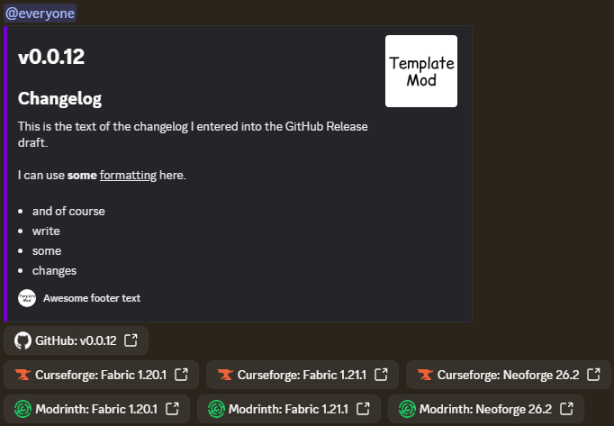

# Publishing Minecraft mod workflows
This repository contains reusable GitHub Action workflows that allows to automatically compile and publish minecraft mod to 
Github release, [Curseforge](https://www.curseforge.com/), [Modrinth](https://modrinth.com/) and announce it to Discord.
Internally uses [Mod publish plugin created by Modmuss](https://github.com/modmuss50/mod-publish-plugin).
The workflows are written with support for multi-branch releases for publishing different jars for different versions and mod loaders.

Available workflows:
- **Release a new version**, upload it to Curseforge, Modrinth, Github release and send announcement to Discord webhook
- **Build a nightly (preview) jar** and optionally post it to Discord webhook

Requirements for the mod repository:
- Installed [Gradle wrapper](https://docs.gradle.org/current/userguide/gradle_wrapper.html)
- Buildable with `gradlew build`
- Project version must be set in properties or toml file (`some_property=value` or `property="value"`)
- Each configured branch must produce exactly one artifact (mod jar) with a unique name

[//]: # (TODO: Add support for multiple artifact per branch)
[//]: # (Group artifact configs per branch -> execute compilation -> upload artifacts for each glob configured for the branch)

Currently missing features that might be added in the future:
- Support for multiple artifacts per branch
- Support for Beta / Alpha versions and GitHub Pre-Releases
- Support for other platforms supported by the Mod publish plugin
- Support for Minecraft version range

___

## Publication process

**[For setup instructions see docs/meain-release.md](docs/main-release.md)**

Summary of the publication process:
1. GitHub Release Draft is created
2. Mod jars are compiled from all configured branches and attached to the release draft
3. Bump version commits are pushed to every configured branch
4. The mod author fills in the changelog and publishes the release
5. All jars are uploaded to the configured platforms (Curseforge, Modrinth)
6. Discord announcement is sent

Each jar is published to each platform as a specific GitHub workflow job shown in the workflow detail.
Each such job can be individually re-run to perform the upload again.

## Nightly build process

**[For setup instructions see docs/nightly-build.md](docs/nightly-build.md)**

Summary of the nightly build process:
1. The build is triggered
   1. A commit with a keyword is pushed to a configured branch
   2. The build is manually triggered from GitHub UI
2. The nightly jar is compiled from the branch
3. Discord nightly build announcement is sent
4. The jar is uploaded to discord if meets the server upload limit

## Comparison of popular tools

The goal of this repository is to provide reusable workflows for my (and possibly others) mods.
This configures the GitHub workflows and does not directly upload the compiled mod, it uses a tool under the hood for it.

Out there mods seem to often use the following tools (sorted by popularity):
- Gradle plugin [Mod Publish](https://github.com/modmuss50/mod-publish-plugin) by [Modmuss](https://github.com/modmuss50)
  - Supports publishing to GitHub release, Curseforge, Modrinth, Discord (and other git platforms).
  - Created by Fabric core maintainer
  - Used for example by [Fabric API](https://github.com/FabricMC/fabric-api) and related projects, 
  [Sodium](https://github.com/CaffeineMC/sodium),
  [Lithium](https://github.com/CaffeineMC/lithium),
  [FerriteCore](https://github.com/malte0811/FerriteCore),
  [JustEnoughItems](https://github.com/mezz/JustEnoughItems),
  [ModernFix](https://github.com/embeddedt/ModernFix)
- GitHub action [MC Publish](https://github.com/Kira-NT/mc-publish) by [Kira NT](https://github.com/Kira-NT)
  - Supports publishing to GitHub release, Curseforge and Modrinth
  - Used for example by [Iris](https://github.com/IrisShaders/Iris)
- Gradle plugin [Mod publisher](https://github.com/firstdarkdev/modpublisher) by [First Dark Development](https://github.com/firstdarkdev)
  - Supports publishing to GitHub release, Curseforge, Modrinth, NightBloom and Modtale
  - Used for example by [LostCities](https://github.com/McJtyMods/LostCities),
  [Oh The Biomes We've Gone](https://github.com/Potion-Studios/Oh-The-Biomes-Weve-Gone),
  [Simple RPC](https://github.com/firstdarkdev/simple-rpc)

- Gradle plugins [Cursegradle](https://github.com/matthewprenger/CurseGradle) and [Minotaur](https://github.com/modrinth/minotaur)
  - Gradle plugins developed for publishing to individual platforms, Minotaur is even official tool
  - Used under the hood for example by [ModMenu](https://github.com/TerraformersMC/ModMenu),
    [Architectury API](https://github.com/architectury/architectury-api)
    

Personally when I first searched for a solution to release my mod automatically to Curseforge and Modrinth
I was primarly looking for a GitHub action and I ended up with [MC Publish](https://github.com/Kira-NT/mc-publish) by [Kira NT](https://github.com/Kira-NT).
I configured my own pipeline using this action and it worked well!

However, the workflow configuration was not a simple one and consisted of two full workflows.
As I created more mods, copying and configuring those full-blown workflows for each mod repository started to feel repetitive
and unfeasible for doing changes to those workflows across multiple projects.

Primarily for this reason I decided to create this repository and create reusable workflows that would be triggered from my other repositories
with a lightweight and short workflows configured in the caller projects.

Naturally my original plan was to use the [MC Publish](https://github.com/Kira-NT/mc-publish) GitHub action for the actuall artifact upload again.
While it works well, it wasn't updated in last 2 years (as per 2026-07-03).
Once I checked other projects (and `creator-resources` channel on Modrinth discord) 
I learned about the other tools listed above.
Using
[Cursegradle](https://github.com/matthewprenger/CurseGradle) 
and [Minotaur](https://github.com/modrinth/minotaur)
would certainly ensure some independency and official support from Modrinth.
However, I think
[Mod Publish](https://github.com/modmuss50/mod-publish-plugin) by [Modmuss](https://github.com/modmuss50)
showed it's trustworthiness.
It is being developed by developer of Fabric and it is being used by some of the largest modern Minecraft mods.

For this reason, this workflow uses
[Mod Publish](https://github.com/modmuss50/mod-publish-plugin) by [Modmuss](https://github.com/modmuss50)
under the hood.