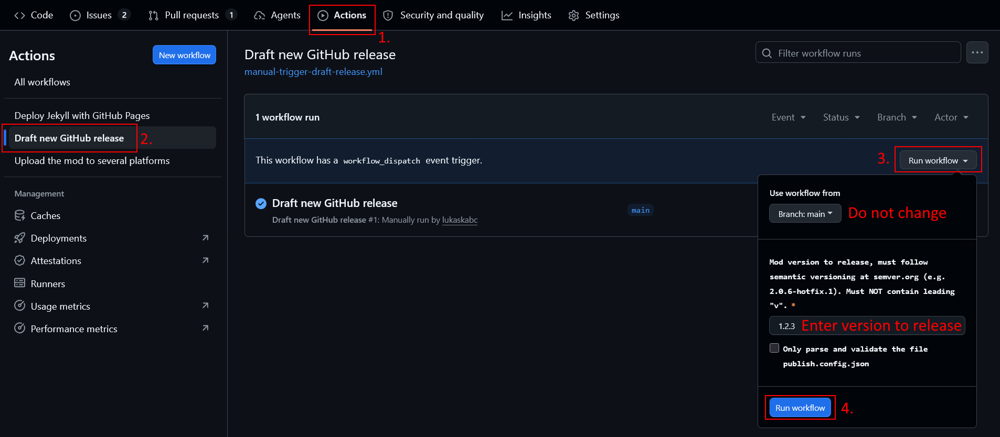
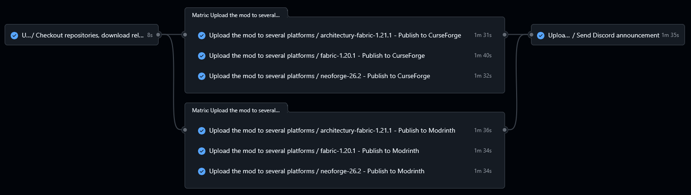
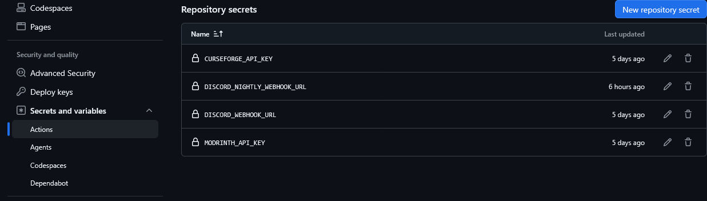

# New version release workflow

[For setup, see the section below.](#setup)

The process to release a new version consists of the following steps:
1. The author manually triggers draft release pipeline with the **version number** in the GitHub UI

- A GitHub release draft is created for the main branch
- For each involved branch:
    - The artifact is compiled
    - 2 commits are pushed advancing the version set in the configured files
        - 1.The version being published (e.g. 1.2.3)
        - 2.The next development version (e.g. 1.2.4-alpha)
    - The artifact is attached to the release draft
    - **(During the process, there must be no new commits added to the involved branches)**
    - Each configured branch can produce only a single artifact!

2. The mod author fills the GitHub release draft description with the **changelog**
3. The mod author can access the attached jars and test them locally if desired
4. The mod author publishes the GitHub release
5. The mod publish workflow is automatically triggered
- JARs are downloaded from the GitHub release
- JARs are published using the [Mod publish plugin created by Modmuss](https://github.com/modmuss50/mod-publish-plugin) to (if configured)
  - Curseforge
  - Modrinth

6. After all artifacts are successfully published to both Modrinth and Curseforge, an announcement is sent to Discord webhook

# Setup

You can check [testing repository](https://github.com/lukaskabc/Testing-MC-mod-project/)
with example setup.

## 1. Create GitHub workflows in your repository

In your repository **only on your main branch** create directory `/.github/workflows/` and copy template files from this repository from [`/.github/workflows/template`](../.github/workflows/template).

- Copy the [`release-trigger-mod-publish.yml`](.github/workflows/template/release-trigger-mod-publish.yml)
- Choose and copy **ONE OF** [`tag-trigger-draft-release.yml`](.github/workflows/template/tag-trigger-draft-release.yml) or [`manual-trigger-draft-release.yml`](.github/workflows/template/manual-trigger-draft-release.yml) (Do NOT use both workflows at the same time)
- Choose a specific version/ref from this repository (or rather a specific commit hash) and update **BOTH** copied files with the chosen version/hash/ref

## 2. Create a configuration file

In your repository **only on your main branch**, in the root directory, create file named `publish.config.json`.
This file has to be on the default branch (where release tags will be created) and contains configuration describing each involved branch.

The config must follow the [`publish.config.schema.json`](publish.config.schema.json) JSON schema.

You can use config editor at https://lukaskabc.github.io/Minecraft-Mod-Publish-Workflows/  
If you are using a specific version of the workflow, you need to update the link to the schema to respect your exact version.
The page must not show any errors, otherwise the config is invalid and the pipeline will fail.
The schema is not able to validate everything.
Make sure to carefully read the description for every field.

## 3. Setup secrets

Go to your GitHub repository > Settings > Secrets and variables > Actions > **Repository secrets**

Based on platforms you enabled in the configuration file, create the following **Repository secrets**:

- `CURSEFORGE_API_KEY`
    - You can create the API key in [account settings at Curseforge](https://legacy.curseforge.com/account/api-tokens).
    - Example: `d6bf5492-ac5f-4ee4-ad2d-f863d24ef859`
- `MODRINTH_API_KEY`
    - You can create personal access token in [account settings at Modrinth](https://modrinth.com/settings/pats).
    - The token MUST have the following scopes:
        - `Create versions`
        - `Read versions`
        - `Write versions`
        - You should not allow any other scopes
        - Make sure to not set too short expiration period, after that date, the token will no longer work!
- `DISCORD_WEBHOOK_URL`
    - On your discord server pick a channel in which you want the announcements to be posted
    - Text channel > Edit channel > Integrations > Webhooks
        - Or server settings > Integrations > Webhooks
    - Choose `Copy Webhook URL` to get the URL and set it as the value of the GitHub repository secret

